<div align="center">

# 🌊 FloodGuard India

### Dam-break and flash-flood inundation modelling for any Indian river

**Smart India Hackathon — Problem Statement 26161**

[](SPEC.md)
[](docs/validation/summary.md)
[](backend/tests)
[](data/library/index.json)


*Simulate a dam break from real terrain. Route the wave with a verified solver.*
*Count who is in its path. Trace every number back to the file it came from.*

**SIH 2026 · Team ITProfessionals (172707)** ·

</div>

---

## 📋 The problem

> **PS 26161 — "Dam Break Inundation Modelling Using Hydrodynamic Modelling of any River."**

When a large dam fails, the reservoir does not drain — it collapses. Tehri holds
3,540 million cubic metres behind a 260 m head. A breach releases that into a
Himalayan gorge, and the wave reaches the first town in **minutes**, not hours.
Downstream lie Devprayag, Rishikesh and Haridwar.

Answering *"what happens, where, and how long do people have"* requires four
things that rarely exist together:

| The gap | Why it matters |
| :-- | :-- |
| 🏔️ **Real terrain, not a textbook channel** | Flood extent is set by the valley's shape. A 1D channel model cannot tell you which neighbourhood floods. |
| ⚙️ **A solver that is actually correct** | A 2D shallow-water code that is not well-balanced invents metres-per-second currents on a still lake. The map still looks plausible. |
| 🔁 **Generality, not one tuned valley** | A model that works only for the dam it was built for is a case study, not a tool. |
| 👥 **Consequences, not just water** | "Peak depth 12 m" is not actionable. "149,407 people, 16 hospitals and clinics, first water 10 minutes after the breach starts" is (Tehri, full reservoir, 120 m preset). |

FloodGuard India is built to close all four — and to **refuse to answer** when it
cannot, rather than guessing.

---

## 🎯 What we set out to build

The problem statement asks for seven deliverables. Here is each one, and where
it honestly stands today.

| # | Deliverable | Status |
| :--: | :-- | :-- |
| 1 | Generalized framework simulating dam break / river blockage from real DEM + hydrological data | ✅ **Done** — complete dam break (precomputed + live), partial breach (live, user-set depth fraction labelled as an assumption), landslide-dam / river blockage (barrier burned into the DEM, peak cross-checked against Costa 1985) |
| 2 | **Two independent hydrodynamic engines** with a quantitative comparison | ✅ **FloodGuard-SWE** (finite volume, verified 8/8) + **FloodGuard-SPH** (particles, 4/5 — one regression, shown not hidden); comparison table, CSI/POD/FAR, difference raster, swipe map |
| 3 | Inundation scenarios from swappable input datasets — any river, any dam | ✅ **Done** — adding a dam is a YAML file; 12 precomputed presets (2 dams × 3 reservoir levels × 120 m / 60 m) |
| 4 | Web dashboard for input and output, handling large rasters | ✅ **Done** — instant presets, labelled quick estimates, tiled layers, animated frames with playback speed, swipe comparison, 3D view, uploads, share links, dark/light theme |
| 5 | Exports to `.shp`, `.kml`, `.geojson`, `.tif` + PDF report | ✅ **Done** — plus COG, KMZ, per-frame wave-animation KMZ, CAP 1.2 XML, Delft3D-FM input deck |
| 6 | Near-real-time flood mapping via Google Earth Engine + Sentinel-1 | 🟡 **Runs against real Sentinel-1** (access configured); detection **not yet validated** — the Monitoring page is marked *Experimental* |
| 7+ | **Early warning** (beyond the brief) | ✅ Alert level per town (RED/ORANGE/YELLOW), lead time, nearest safe ground; bulletin in English and Hindi; SMS texts; **CAP 1.2** alert (the format behind NDMA's SACHET), Exercise status only |
| 7 | HADR loss-and-damage analysis inside the inundation polygon | ✅ **Done for both dams** — population (WorldPop), buildings, roads, hospitals, schools, bridges (OSM), cropland (ESA WorldCover); **loss-of-life range, Graham (1999)**, officials-only |

> **Why the honest status column?** Because rule #1 of this project is that
> nothing claims to be more finished than it is — including this README. A
> deliverable marked 🟡 is one whose code you can inspect today; it is not
> vapour, and it is not pretending to be complete.

---

## 🗺️ How it works — the full pipeline

```mermaid
flowchart TB
    subgraph IN["📥 PHASE 1 · INPUTS — real, checksummed, cached"]
        direction LR
        DEM["<b>Copernicus GLO-30</b><br/>AWS · keyless · SHA256"]
        NRLD["<b>CWC NRLD-2019</b><br/>30 dams · cited per field"]
        EXP["<b>OSM + WorldPop</b><br/>buildings · roads · people"]
        SAT["<b>Sentinel-1 GRD</b><br/>via Earth Engine"]
    end

    YAML["⚙️ <b>Scenario YAML</b><br/>dam · river · breach · resolution · duration<br/><i>adding a dam changes no code</i>"]

    subgraph PRE["🏔️ PHASE 2 · TERRAIN CONDITIONING"]
        direction LR
        HYD["Priority-flood fill<br/>D8 · accumulation<br/>watershed · corridor mask"]
        RES["Reservoir delineation<br/>elevation–area–capacity<br/>bathymetry calibrated to NRLD storage"]
        SEC["Cross-sections + town gauges<br/>at towns + 10 km<br/>Manning n from WorldCover"]
    end

    subgraph BR["💥 PHASE 3 · BREACH + RESERVOIR ROUTING"]
        direction LR
        PAR["<b>3 breach models</b><br/>Froehlich 2008<br/>Von Thun and Gillette 1990<br/>MacDonald and L-M 1984<br/><i>+ landslide dams: Costa 1985 check</i>"]
        OUT["Weir + orifice outflow<br/>Villemonte submergence<br/>level-pool · adaptive RK2"]
    end

    HYDRO["📈 <b>Breach hydrograph Q(t)</b><br/>mass closure 0.0000%<br/><i>validated vs Teton 1976 and Banqiao 1975</i>"]

    subgraph ENG["🌊 PHASE 4 · HYDRODYNAMIC ENGINES — one contract"]
        direction LR
        SWE["<b>FloodGuard-SWE</b> ✅<br/>Godunov FV · MUSCL-minmod<br/>HLLC · Audusse well-balanced<br/>outflow limiter · numba-jitted<br/><b>verified 8/8</b>"]
        ALT["<b>FloodGuard-SPH</b> 🟡<br/>depth-integrated SPH<br/>Wendland C2 · Monaghan AV<br/>exact momentum conservation<br/><b>verified 4/5</b>"]
        ADP["<b>Adapters</b> 📦<br/>Delft3D FM deck<br/>DualSPHysics CaseDef<br/><i>run if binaries exist</i>"]
    end

    subgraph POST["🎨 PHASE 5 · RASTERS, HAZARD, EXPORTS"]
        direction LR
        RAS["max depth · max velocity<br/>arrival time · D×V hazard"]
        HAZ["AIDR Handbook 7 §6.1<br/>hazard classification"]
        EXPT["COG · SHP · GeoJSON<br/>KML / KMZ · CSV"]
    end

    IMP["👥 <b>PHASE 6 · HADR IMPACT</b><br/>population · buildings · roads · hospitals<br/>schools · bridges · cropland · evacuation priority<br/>loss-of-life range (Graham 1999)"]

    GEE["🛰️ <b>PHASE 8 · NEAR-REAL-TIME</b> (experimental)<br/>Sentinel-1 change detection · layover/shadow masks<br/>Otsu near the water edge · JRC water excluded<br/>CSI / POD / FAR vs simulation"]

    subgraph DEL["🖥️ PHASE 7 · 9 · 10 · DELIVERY"]
        direction LR
        API["<b>FastAPI</b><br/>preset library · detached workers<br/>SQLite job store · WebSocket progress"]
        UI["<b>React + MapLibre</b><br/>presets · quick estimate · 3D<br/>gauges · provenance · sensitivity"]
        PDF["<b>PDF report</b><br/>git hash on every page<br/>caveats in the body"]
    end

    PROV["🔒 <b>PROVENANCE ON EVERY OUTPUT</b><br/>DEM source · dam parameters + citations · engine + version<br/>solver settings · git commit · UTC timestamp"]

    DEM --> YAML
    NRLD --> YAML
    EXP -.-> IMP
    SAT -.-> GEE
    YAML --> PRE
    PRE --> BR
    BR --> HYDRO
    HYDRO --> ENG
    ENG --> POST
    POST --> IMP
    POST --> DEL
    IMP --> DEL
    GEE --> DEL
    POST -.->|"CSI / POD / FAR"| GEE
    DEL --> PROV

    classDef keyNode fill:#EAF3FB,stroke:#2C6FAF,stroke-width:2px,color:#0B2A45
    classDef pending fill:#FFF6E0,stroke:#D68A00,stroke-width:2px,color:#0B2A45
    classDef rule fill:#F3EDFB,stroke:#7B4FC0,stroke-width:2px,color:#0B2A45

    class YAML,HYDRO keyNode
    class IMP,GEE pending
    class PROV rule
```



**Read it as a contract.** Each stage consumes files and emits files, and every
emitted file records what produced it. There is no step at which a number is
introduced by hand.

---

## ⭐ What makes this different

Most dam-break demos show a map. The three things that matter here sit behind it.

### 1️⃣ The solver is verified against exact analytical solutions

Verification asks whether the code solves the equations it *claims* to solve.
These are closed-form solutions and exact invariants, so the comparison is not a
matter of opinion.

| Check | Result | Criterion |
| :-- | :-- | :-- |
| **Ritter (1892)** dry-bed dam break | relative L2 **0.305%**, h(dam) error **0.94%** | < 5% |
| **Stoker (1957)** wet-bed dam break | relative L2 **0.725%**, shock within **0.4 cells** | < 12 cells |
| **Lake at rest**, irregular bed (118 m relief) | spurious discharge **3.92e-12**, drift **1.42e-14 m** | < 1e-10 |
| **Mass conservation**, fully wet | relative volume error **1.72e-16** | < 1e-9 |
| **Wet/dry mass budget** | relative mass loss **0.001%** | < 1% |
| **Grid convergence** (Ritter) | observed order **0.91** | > 0.8 |
| **Frictional dam break** | rough 1175 m < frictionless 1318 m ≤ Ritter 1396 m | never outruns Ritter |
| **Thacker (1981)** parabolic bowl, moving shoreline | period error **0.01%**, NSE **0.999997** | ≤ 5% |

```bash
make validate     # all 13 checks (8 FV + 5 SPH) in ~6 seconds
```

Plots and full error tables: **[`docs/validation/`](docs/validation/)**.

**Real terrain is checked too.** The first real-terrain runs exposed four bugs
that created water (routing from an empty pool, a reservoir curve built at the
wrong level, breach inflow for time that never elapsed, positivity clipping).
All four are fixed with regression tests, and **every run now records its own
mass balance** — `volume_created_by_positivity_m3` is **0** on the six 120 m
presets, Tehri closes to **0.03%**, and the solver mass error is at most **1.2%**
across all 12 presets (Tehri ≤ 0.11%). Any numerical mass gain above 1% is a
run warning.
Details: [`docs/HANDOFF.md`](docs/HANDOFF.md) R3.3.

> The Ritter front lags the analytical front by 18.3%, and that is **documented,
> not hidden**: a monotone second-order scheme cannot resolve the infinite
> gradient where depth reaches zero. What matters is the direction — the
> modelled flood must never arrive *earlier* than physics allows.

### ➕ Two engines that share no numerics

The problem statement asks for SPH *and* a Delft3D-class solver, compared.
**FloodGuard-SPH** solves the same shallow-water equations as particles: no
mesh, no Riemann solver, depth by kernel summation, shocks by artificial
viscosity. Both run on the same grid, bed and breach hydrograph, so their
differences are numerical, and the dashboard shows them: a side-by-side table
with signed differences, CSI/POD/FAR of the extents, depth RMSE, per-town
arrival by engine, a swipe map and a difference raster.

| SPH check | Result |
| :-- | :-- |
| Ritter dry-bed | ❌ relative L2 **7.52 %** passes, but h(dam) error **10.03 %** fails its 5 % criterion; front never leads |
| Stoker wet-bed | relative L2 **4.51 %**, shock within 1.1 spacings |
| Volume / momentum | **0** / **2.2e-16** — exact by construction |
| Lake at rest | spurious Froude **1.97e-3** (measured, not exact — stated) |
| Refinement | error falls monotonically (9.84 → 7.13 %), order 0.15 |

> **Open regression.** SPH passed 5/5 before round 2's last SPH-settings patch;
> its Ritter check fails now, most likely because of that patch. The failure is
> shown in the validation table rather than hidden. No preset uses SPH — they
> run on FloodGuard-SWE only.

It is labelled `FloodGuard-SPH (depth-integrated SWE-SPH)` everywhere — never
PySPH, never DualSPHysics — because it is not a 3D solve of the breach near
field. See [METHODOLOGY §4.5](docs/METHODOLOGY.md).

### 2️⃣ Nothing is labelled as something it is not

`GET /api/health/engines` probes the machine. When Delft3D binaries are absent,
the API response, the UI badge and the PDF cover all read
`FloodGuard-SWE (Delft3D-class FV solver)` — **never** `Delft3D`.

Three tests fail the build if any code path emits the wrong string:

```
test_health.py::test_unavailable_delft3d_is_never_labelled_delft3d
test_swe_fv.py::test_engine_never_claims_to_be_delft3d
test_engines_adapters.py::test_delft3d_refuses_to_run_without_a_binary
```

The same rule holds for SPH. PySPH is named when PySPH runs; when it cannot, the
engine reports itself **unavailable** rather than returning a depth-averaged
result under an SPH label.

### 3️⃣ "Not computed" is never rendered as zero

A layer that failed to download shows an **em dash** and a reason on hover.
`None` in Python, `null` in JSON, `—` in the UI. Enforced in
[`frontend/src/components/Value.tsx`](frontend/src/components/Value.tsx); there
is no code path that turns a null into a number.

*Zero buildings flooded* and *we could not fetch the building layer* are
different statements about the world. Conflating them in a flood exposure report
is dangerous.

### 4️⃣ Instant answers that say how they were made

A full 6-hour Tehri run takes minutes; a control room cannot wait. So the
dashboard has three run modes, and **every result carries its mode** in
`result.json`, the summary, the map badge and the PDF:

| Mode | What it is | Badge |
| :-- | :-- | :-- |
| **Precomputed** | 12 presets (Tehri + Hirakud × FRL / mid / MDDL × 120 m / 60 m), loaded in about a second from `data/runs/lib_*` | *Precomputed on 2026-09-30 · 120 m · 6 h simulated* |
| **Quick estimate** | anything else, run live at 200 m for 1 simulated hour | *Quick estimate · 200 m · 1 h simulated* |
| **Full** | CLI / server runs at any resolution (60 m, 30 m) | resolution and duration as run |

Jobs run in a **detached worker process**: they survive an API restart, and
**Stop run** kills the process tree at once and discards partial output.
Presets move between machines as checksummed **data packs**
(`floodguard pack export / import`).

### 5️⃣ Every number can be traced — and questioned

- **Provenance panel** — every value on screen with the `result.json` field or
  GeoTIFF tag it was read from, cautions first.
- **Town gauges** — depth-time curves at each town *and* at the river beside it
  (Rishikesh's town point stays dry 2.3 km from the river; the river beside it
  is reached at 264 min and still rising at 6 h — both are shown).
- **What matters most (sensitivity)** — each breach input moved alone across the
  range the published models disagree over. Tehri: formation time dominates the
  peak; Hirakud: breach width does.
- **Loss of life** — Graham (1999, USBR DSO-99-06) rate table transcribed from
  the report; always a range, labelled a planning estimate, officials-only.

---

## 🚀 Quickstart

```bash
git clone https://github.com/kalpitphogat/Flood-Guard.git && cd Flood-Guard

python -m venv .venv && source .venv/bin/activate   # Windows: .venv\Scripts\activate
pip install -r requirements.txt && pip install -e backend
cd frontend && npm install && cd ..
```

Verify the install **in this order**:

```bash
python -m floodguard.cli engines      # honest engine availability table
make test                             # backend pytest + frontend Vitest
python -m floodguard.cli validate     # 8 FV + 5 SPH checks
python -m floodguard.cli demo --check # preflight
```

**Fastest path to a demo** — import the precomputed presets and serve:

```bash
python -m floodguard.cli pack import floodguard_demo_presets.fgpack   # 12 runs, ~296 MB
make serve                                                           # ONE process -> http://localhost:8000
```

Or compute everything yourself:

```bash
make data        SCENARIO=tehri_bhagirathi   # DEM, WorldPop, OSM, ESA WorldCover
make precompute                              # the preset library (120 m, swe_fv)
make simulate-both SCENARIO=tehri_bhagirathi # both engines, 90 m
make serve
```

The demo pack is not in git (it lives in `data/library/`); copy it to the demo
machine separately.

`make serve` builds the dashboard and lets the API serve it, so a venue needs
one process on one port. `docker compose up --build` does the same in a
container (see `Dockerfile`). For development, `make serve-backend` +
`make serve-frontend` still gives hot reload on :5173.

<details>
<summary><b>conda path, if you want ANUGA as the cross-check engine</b></summary>

```bash
conda env create -f environment.yml
conda activate floodguard
pip install -e backend
conda install -c conda-forge anuga
```

ANUGA ships on conda-forge only. Without it, the independent cross-check engine
is reported **unavailable** rather than silently skipped, and the comparison
table says so instead of showing placeholder numbers.

</details>

<details>
<summary><b>Rebuilding data on a fresh clone</b></summary>

`data/raw/`, `data/processed/`, `data/runs/` and `reference/` are gitignored, so
a fresh clone has no DEM and no completed runs.

```bash
python scripts/clone_references.py     # 8 reference repos — docs/AUDIT.md context
python scripts/build_dam_catalog.py    # rebuilds data/catalog/dams.geojson
```

`build_dam_catalog.py` reads from `reference/hydrobreach/`, so clone the
references **first**.

Optional credentials, read from a git-ignored `.env`:
`OPENTOPO_API_KEY` (DEM fallback only — the keyless AWS path works) and
`GOOGLE_APPLICATION_CREDENTIALS` + `EE_PROJECT` (required for Phase 8 to do
anything real).

</details>

---

## 🔍 What is real, and what is a documented substitute

| Component | Status on a clean machine |
| :-- | :-- |
| 🟢 **FloodGuard-SWE** 2D solver | **Real.** Verified 8/8. Powers every preset |
| 🟢 Preset library | **Real.** 12 runs computed 2026-09-30 with the fixed solver; instant load; run mode on every output |
| 🟢 Quick estimate | **Real.** Any other scenario live at 200 m / 1 h, labelled as such |
| 🟢 Breach models | **Real.** Froehlich, Von Thun & Gillette, MacDonald — all three run, spread reported; sensitivity (tornado) per run |
| 🟢 Failure types | **Complete break** real; **partial breach** real but live only (breach-depth fraction is a user assumption, labelled); **landslide dam** real with user-supplied breach size + Costa (1985) check; **overtopping** is a label only — routed like a complete break, listed as "not modelled distinctly yet" |
| 🟢 DEM acquisition | **Real.** Copernicus GLO-30 from AWS, SHA256-checksummed |
| 🟢 Dam catalog | **Real.** 30 dams, CWC NRLD-2019, cited per field to PDF page and PIC code |
| 🟢 GIS exports | **Real.** COG, zipped SHP, GeoJSON, KML, KMZ, per-frame wave KMZ, CSV |
| 🟢 PDF report | **Real.** 6 pages, provenance on every page |
| 🟡 **FloodGuard-SPH** second engine | **Real, 4/5** — the Ritter h(dam) check regressed (10.03% > 5%); comparison populates itself when both engines run; slow on real terrain (open issue) |
| 🟢 Dashboard | **Real.** Presets + quick estimate, layers (depth, velocity, arrival, AIDR hazard, engine difference), animated frames with playback speed, swipe map, 3D terrain, town gauges, provenance, sensitivity, loss of life, uploads, share links, dark/light theme |
| 🟢 Jobs | **Real.** Detached worker per run; survives API restarts; Stop kills the process tree |
| 🟢 Uploads | **Real.** DEM GeoTIFF / hydrograph CSV / AOI (GeoJSON, KML, zipped SHP), validated for CRS, extent and units; refused files list every reason |
| 🟢 Early warning | **Real.** Levels from AIDR hazard + lead time (convention stated on every bulletin), safe ground from the run's own flood surface, EN/HI bulletin, SMS, CAP 1.2 XML, PDF section |
| 🟢 Breach uncertainty | **Real.** All three breach models routed; outflow envelope and peak spread on the dashboard |
| 🟢 Land cover | **Real.** ESA WorldCover 10 m → mapped Manning's n + cropland-in-flood metric |
| 📦 **Delft3D FM** | Deck **generated**; solver runs only if `dflowfm` is on PATH |
| 📦 **DualSPHysics** | `CaseDef.xml` **generated**; needs GenCase + DualSPHysics binaries |
| 🟡 **ANUGA** | conda-forge only; reported unavailable otherwise |
| 🟡 **PySPH** | Needs a C compiler; a request for it runs FloodGuard-SPH and the badge says so |
| 🟡 **GEE monitoring** | Runs against real Sentinel-1 when credentials are set (503 with a named reason otherwise); detection **not validated** — page marked *Experimental* |
| 🟢 Exposure analysis | **Real** for both dams. "Not computed" only where a layer is missing |
| 🟢 Loss of life | **Real.** Graham (1999) Table 7, per-cell severity × warning time; always a range; officials-only (never in SMS/CAP) |
| 🟢 3D view | deck.gl TerrainLayer over the run's own bed, water surface draped, animates with the frames |

> The Delft3D deck is a deliverable in its own right: a complete UGRID `_net.nc`,
> `.mdu`, boundary `.pli` and `.bc` carrying the breach hydrograph, and a DIMR
> config — generated from a DEM and a dam record. It runs the moment you point it
> at a licensed solver.

---

## 🏞️ Demo scenarios — generality, proven

Deliberately opposite regimes, to show the framework is general rather than
tuned to one valley. **Same code. Different YAML.**

| | 🏔️ Tehri | 🌾 Hirakud |
| :-- | :-- | :-- |
| **River** | Bhagirathi → Ganga | Mahanadi |
| **Head** | 260 m | 61 m |
| **Storage (NRLD)** | 3,540 MCM | 8,136 MCM |
| **Terrain** | Himalayan gorge | Deltaic plain |
| **Wave** | Deep, fast — **minutes** of warning | Wide, slow — **hours** of warning |
| **What it tests** | Vertical accuracy, shock capture | Inundation area, lateral spreading |

**Reservoir reconstruction against the register:** Tehri, built to FRL with the
NRLD surface area (52.0 km², Uttarakhand p.263), stores **3,526 MCM vs 3,540 MCM
in NRLD (−0.4%)** — and the FRL breach releases exactly that volume.

### Measured results — the 12 precomputed presets

Complete dam break, FloodGuard-SWE, computed 2026-09-30 with the fixed solver.
Flooded = depth > 0.3 m. Population = WorldPop inside the flood. Read from each
run's `result.json`; wall time from `data/library/index.json`.

| Dam · level | Grid | Peak outflow | Time to peak | Released | Flooded | Population | Buildings | Wall time |
| :-- | --: | --: | --: | --: | --: | --: | --: | --: |
| Tehri · FRL 830.00 m | 120 m | 1,488,649 m³/s | 80 min | 3,526 MCM | 154.8 km² | 149,407 | 208 | 178.5 s |
| Tehri · FRL 830.00 m | 60 m | 1,498,226 m³/s | 80 min | 3,524 MCM | 157.5 km² | 142,293 | 288 | 4,198 s |
| Tehri · mid 785.00 m | 120 m | 760,017 m³/s | 88 min | 1,692 MCM | 79.6 km² | 60,481 | 173 | 160.8 s |
| Tehri · mid 785.00 m | 60 m | 748,483 m³/s | 87 min | 1,643 MCM | 114.7 km² | 94,234 | 199 | 2,082 s |
| Tehri · MDDL 740.00 m | 120 m | 279,642 m³/s | 101 min | 540 MCM | 28.1 km² | 16,618 | 2 | 139.2 s |
| Tehri · MDDL 740.00 m | 60 m | 269,468 m³/s | 99 min | 508 MCM | 34.4 km² | 20,966 | 25 | 1,933 s |
| Hirakud · FRL 192.02 m | 120 m | 364,434 m³/s | 530 min | 7,775 MCM | 1,438.2 km² | 826,857 | 10,134 | 428.4 s |
| Hirakud · FRL 192.02 m | 60 m | 365,876 m³/s | 530 min | 7,746 MCM | 1,431.1 km² | 824,097 | 10,130 | 4,115 s |
| Hirakud · mid 185.93 m | 120 m | 287,905 m³/s | 593 min | 4,588 MCM | 1,105.6 km² | 710,645 | 9,342 | 344.8 s |
| Hirakud · mid 185.93 m | 60 m | 286,597 m³/s | 593 min | 4,474 MCM | 1,086.1 km² | 699,300 | 9,272 | 3,437 s |
| Hirakud · MDDL 179.83 m | 120 m | 163,749 m³/s | 634 min | 2,034 MCM | 662.6 km² | 470,743 | 6,675 | 279.6 s |
| Hirakud · MDDL 179.83 m | 60 m | 159,323 m³/s | 627 min | 1,947 MCM | 633.7 km² | 450,008 | 6,206 | 2,637 s |

Tehri runs simulate 6 h (laptop, i7-13650HX); Hirakud 24 h (server, i9-12900K).
Other measured points (Tehri FRL, 120 m): first water 10 min after the breach
starts; the river at Rishikesh reached at 264 min, still rising at 6 h; Graham
(1999) loss of life **813–8,840** with warning at breach start vs
**1,436–16,851** if warned 1 h late (148,354 modelled residents).

> **Read these as model output, not a forecast.** They are unverified against an
> independent study; 120 m cells average Tehri's narrow gorge into large cells;
> the DEM is a surface model; the Tehri reservoir curve overstates live storage
> at MDDL by ~14%; Hirakud's FRL run releases 7,775 MCM against 8,136 MCM in
> the register. See [`docs/HANDOFF.md`](docs/HANDOFF.md) R3.7.

> Tehri is on the **Bhagirathi**, not the Alaknanda. Those two meet at
> **Devprayag** to form the Ganga, which then flows through Rishikesh and
> Haridwar. Getting this wrong sends the flood down the wrong valley.

---

## 🗂️ Repository layout

```
backend/app/              FastAPI: routes, config, provenance, job store, schemas
  schemas/models.py       <- THE API CONTRACT
backend/floodguard/       the science package - importable and CLI-usable
  scenario.py             <- start here to understand the data model
  pipeline.py             <- end-to-end orchestration; engine substitution decided here
  library.py              <- preset library + `precompute`
  packs.py                .fgpack export / import (checksummed, all-or-nothing)
  data/                   fetchers: DEM, dams, OSM, population, land cover, GEE
  preprocess/             conditioning, corridor, reservoir, cross-sections, blockage barrier
  breach/                 parameter models, outflow, routing, natural dams, sensitivity
  engines/                Engine interface + backends, numba kernels (outflow limiter)
  postprocess/            hazard, GIS exports, town gauges, run provenance
  impact/                 HADR exposure + Graham (1999) loss of life
  warning/                alert levels, EN/HI bulletin, SMS, CAP 1.2, safe ground
  compare/                cross-engine metrics
  validation/             analytical solutions (incl. Thacker) + the verification runner
backend/app/core/worker.py  detached run worker
backend/tests/            32 files, 326 passed + 3 skipped
frontend/src/
  components/Value.tsx    <- the "not computed" rule lives here
  components/PresetPicker.tsx, GaugesPanel.tsx, ProvenancePanel.tsx, SensitivityPanel.tsx, LifeLossPanel.tsx
  pages/                  Home, Simulation, RealtimeMonitoring, About
data/scenarios/           tehri_bhagirathi.yaml, hirakud_mahanadi.yaml, examples/ (hypothetical blockage)
data/catalog/             dams.geojson - 30 dams, per-field citations
docs/                     AUDIT, METHODOLOGY, DATA_SOURCES, DEMO_SCRIPT, HANDOFF, validation/
SUBMISSION PPT TEMPLATE/  SIH 2026 idea-submission deck (FLOODGUARD-INDIA_SIH2026_PS26161.pptx)
```

---

## 🛠️ CLI reference

```bash
floodguard engines                                  # honest availability table
floodguard data       --scenario <yaml> [--resolution M] [--skip-osm --skip-population]
floodguard verify                                   # re-hash every cached input
floodguard preprocess --scenario <yaml> [--resolution M]
floodguard breach     --scenario <yaml>             # or --validate for Teton/Banqiao
floodguard simulate   --scenario <yaml> [--resolution M] [--duration H] [--engines a,b]
floodguard precompute --scenario <id> [--resolution 120|60] [--dry-run --limit N --force]
floodguard pack export --runs "lib_*" --out demo.fgpack
floodguard pack import demo.fgpack
floodguard life-loss  --runs "lib_*" [--warning-min -60 --warning-min 0 --warning-min 60]
floodguard impact     [--run <id>]
floodguard report     [--run <id>]                  # PDF
floodguard validate   [--quick]                     # THE GATE - FV 8 + SPH 5 checks
floodguard demo       [--check]
```

| Make target | What it does |
| :-- | :-- |
| `make setup` | Install backend and frontend dependencies |
| `make data` | Fetch and cache every input layer, checksummed |
| `make preprocess` | DEM conditioning, corridor, reservoir curve |
| `make validate` | The 13 verification checks → `docs/validation/` |
| `make simulate` | Headless end-to-end run |
| `make precompute` | Build the preset library for both dams (120 m, `swe_fv`) |
| `make test` | backend pytest + frontend Vitest |
| `make simulate-both` | Both engines on SCENARIO at 90 m |
| `make serve` | Build the dashboard and serve API + UI on :8000 |
| `make profile-sph` | Short SPH-only run with particle diagnostics |

Bad input fails at parse time with one line and exit code 2 (`-v` keeps the
traceback). Targets for unimplemented phases **exit non-zero with a message
naming the phase**. They never print a fabricated result.

> ⚡ **Resolution is the biggest lever** on both runtime and the answer. Cost
> scales as ~1/res³ and peak depths are genuinely resolution-sensitive. 30 m is
> the publication setting; 90–120 m is interactive. Every output records which
> one it used.

---

## 🧭 Roadmap

**P0**

- [x] **Second engine** → FloodGuard-SPH; comparison table, CSI, difference raster, swipe map
- [x] **Exposure layers** fetched for Tehri (OSM needed an identifying User-Agent — fixed)
- [x] **Preset library** — 12 runs (2 dams × 3 levels × 120 m / 60 m) + quick-estimate mode
- [x] **Four solver/pipeline bugs that created water** — fixed, regression-tested, mass balance on every run
- [x] **Detached run worker**, data packs, CLI input validation
- [ ] **One 30 m publication run** — `--resolution 30`, on a server
- [ ] **Tehri against an independent study**, and a 12 h run (the wave is still rising at Rishikesh at 6 h)

**P1 — all built**

- [x] `POST /api/results/{id}/share` → `/s/<code>` short link that restores the view
- [x] Upload endpoints (DEM / hydrograph / AOI) with CRS, extent and unit validation + panel
- [x] Demo Mode toggle — loads a completed run from disk
- [x] Comparison **swipe map**
- [x] **3D view** — deck.gl TerrainLayer + water surface
- [x] Time-indexed tiles — the raster animates from stored solver frames
- [x] Any catalog dam from the GUI (DEM fetched automatically on first run)

**Beyond the brief**

- [x] Early-warning bulletin (EN + Hindi), SMS, CAP 1.2 alert, nearest safe ground
- [x] Breach-model uncertainty envelope + one-at-a-time sensitivity
- [x] Loss of life — Graham (1999), officials-only
- [x] Town gauges, provenance panel, per-frame wave KMZ, playback speed
- [x] Partial breach (live, user-set fraction) and landslide-dam blockage (barrier burned into the DEM, Costa 1985 check)

**P2**

- [x] Frontend tests (Vitest) — null renders `—`, never `0`
- [x] ESA WorldCover → mapped Manning's n + agricultural-area metric
- [x] Docker: single multi-stage image (written; not yet built on a Docker host)
- [ ] Idukki in the catalog — needs the NRLD Kerala sheet transcribed with page citations
- [ ] Malpasset 1959 benchmark — needs the digitised pre-failure DEM
- [x] Thacker parabolic bowl + NSE in `validate`
- [x] GitHub Actions CI workflow (written; not yet executed)
- [ ] **SPH regression** (Ritter h(dam) 10%) and SPH performance on real terrain — see [`docs/HANDOFF.md`](docs/HANDOFF.md)
- [ ] **Overtopping modelled distinctly** — needs a cited basis and an inflow flood
- [ ] GEE flood / blockage-lake detection validated on real events (runs; not validated)
- [ ] `docker compose up --build` executed on a Docker host

---

## 📚 Documentation

| Document | What's in it |
| :-- | :-- |
| **[`SPEC.md`](SPEC.md)** | The contract. §1 is the non-negotiable engineering rules |
| **[`docs/METHODOLOGY.md`](docs/METHODOLOGY.md)** | Equations, schemes, assumptions, verification, **eight stated limitations** |
| **[`docs/AUDIT.md`](docs/AUDIT.md)** | What we found in every reference repo, file by file — including two that were not what they claimed |
| **[`docs/DATA_SOURCES.md`](docs/DATA_SOURCES.md)** | Every dataset, URL, licence, and what each one **cannot** tell you |
| **[`docs/DEMO_SCRIPT.md`](docs/DEMO_SCRIPT.md)** | Five-minute preset walkthrough + the questions judges ask |
| **[`docs/validation/summary.md`](docs/validation/summary.md)** | The verification report, with plots |
| **[`docs/HANDOFF.md`](docs/HANDOFF.md)** | Round-by-round changes (R3.x = round 3), measured timings, what is untested, and exactly what to run |
| **[`SUBMISSION PPT TEMPLATE/`](SUBMISSION%20PPT%20TEMPLATE/)** | The SIH 2026 idea-submission deck for PS 26161 |

---

## ⚖️ Licence and attribution

Input dataset licences are in [`docs/DATA_SOURCES.md`](docs/DATA_SOURCES.md) and
in `data/MANIFEST.json` — URL, SHA256, size, licence and fetch time per file.

Third-party solvers are used within their licences. **DualSPHysics (LGPL-2.1)**
and **Delft3D (AGPL/GPL/LGPL/BSD)** are invoked as external processes or read
only for their file formats — **no source from either is copied into this
repository**. **ANUGA (Apache-2.0)** and **PySPH (BSD/MIT)** are optional
dependencies. **ESA WorldCover** is CC-BY 4.0 and is attributed in every raster
tag and in the manifest.

---

<div align="center">

### The thesis

**This codebase refuses to fake things.**

When it cannot compute something, it surfaces that: `None`, an em dash, a named
reason, a raised `EngineUnavailable`. Never a plausible default. Never a zero.
Never a label for something that did not run.

*A smaller system that is provably correct beats a larger one that is partly
theatre — because the second kind loses the moment someone clicks past the
demo script.*

</div>
